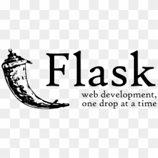
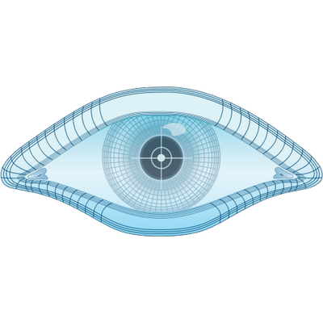

<!-- Banner -->

  

<h1 align="center">
  

   
  <b>Dynamic Cybersecurity Analyst passionate about building secure systems, analyzing network threats, and turning technical challenges into growth.</b> 
   
  <i>Let’s make the digital world safer—one project at a time!</i>

---

## 🚀 About Me

<ul>
  <li>🎓 <b>Cybersecurity & Digital Forensics student</b> at VIT Bhopal (CGPA: 8.09).</li>
  <li>🛡️ Eager about threat analytics, ethical hacking, and cyber defense.</li>
  <li>🛠️ Builder of security tools and ML-powered threat detectors.</li>
  <li>📧 Reach me: shairiyaz11011@gmail.com | <a href="www.linkedin.com/in/shaik-riyaz-761545251">LinkedIn</a> | <a href="">GitHub</a></li>
</ul>

---

## 🛠️ Technical Toolkit

### **Programming Languages:**

  
  
  
  

### **Libraries & Frameworks:**

  
  
  
  
  
  
  
  
  
  
  

### **Cybersecurity Techniques:**

  
  

### **Security Tools:**

  
  
  
  
  

### **Cryptography:**

  

### **Platforms:**

  
  

### **Data Visualization:**

  
  

---

## 🖥️ My Projects

- <b>Steganography GUI</b>  
  Hide/extract secret messages in images via a robust Python/Tkinter app.
- <b>CRYPTOCORNERGUI (CipherForge)</b>  
  Java-based cryptography suite for classic & modern cipher operations.
- <b>Ransomware Traffic Classification Suite</b>  
  ML-powered Python toolkit for network traffic analytics & ransomware threat detection.

Explore these in my pinned repositories below ⬇️

---

## 🎓 Certifications
- 🏅 IBM Cyber Security Analyst (2025)
- 🏅 Oracle Java Foundations Certified Associate (2025)
- 🏅 CEH (in progress)
- 🏅 GUVI (in progress)

---

## 🏆 Achievements

- Led my school as Pupil Leader — building teamwork & leadership skills early.

---

<!-- Animation for end -->

  

<!-- Add a little CSS for fun text glowing effect (works on GitHub web, but has limited CSS support) -->
<!-- For better animation, use services like https://readme-typing-svg.demolab.com -->
